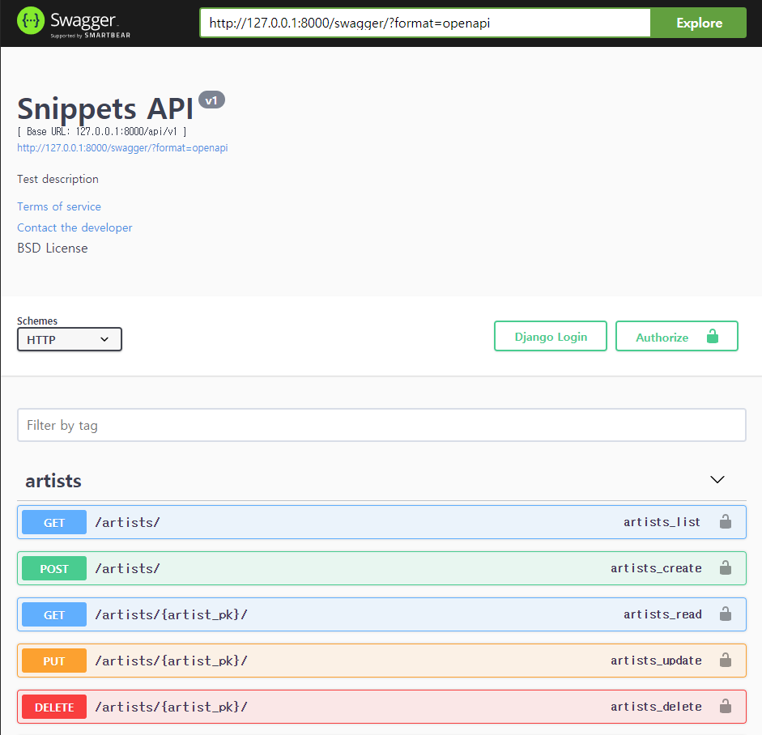
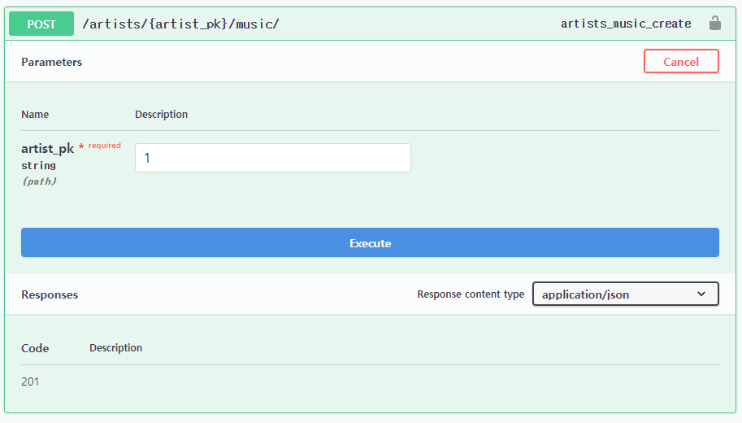

# drf-yasg

[공식페이지](https://github.com/axnsan12/drf-yasg)



drf-yasg(**y**et **a**nother **S**wagger **g**enerator)란 사진처럼 DRF API를 정리해놓은 문서 페이지를 자동으로 만들어 주는 패키지이다.



각 API URL 마다 어떤 Method로 요청을 보내야 하고, 어떤 데이터들을 넘겨 주어야 하는지 알 수 있다. 심지어 이 페이지에서 바로바로 요청을 보내는 테스트도 수행이 가능하다.

## Quick Start

사용 전 주의할 점은 호한 버전을 확인 해야한다.

- Django Rest Framework: 3.8, 3.9, 3.10, 3.11
- Django: 1.11, 2.2, 3.0
- Python: 2.7, 3.6, 3.7, 3.8

자신의 버전을 확인하고 싶다면 `pip list` 명령어를 통해 확인할 수 있고, 만일 지금 버전이 호환 버전에 속하지 않는다면 지우고 호환 버전을 설치하도록 한다.

패키지의 특정 버전을 설치하고 싶다면 설치시  `==버전`을 붙이면 된다.

```bash
$ pip install djangorestframework==3.11
```

### 0. installation

```bash
$ pip install drf-yasg
```

### 1. Configuration

settings.py의 `INSTALLED_APPS`에 `'drf_yasg'`를 추가한다.

```python
INSTALLED_APPS = [
    ...
    'drf_yasg',
    ...
]
```

그리고 프로젝트의 urls.py 에 다음 코드들을 추가한다.

```python
...
from rest_framework import permissions
from drf_yasg.views import get_schema_view
from drf_yasg import openapi

...

schema_view = get_schema_view(
    openapi.Info(
        title="Snippets API",
        default_version='v1',
        description="Test description",
        terms_of_service="https://www.google.com/policies/terms/",
        contact=openapi.Contact(email="contact@snippets.local"),
        license=openapi.License(name="BSD License"),
    ),
    public=True,
    permission_classes=(permissions.AllowAny,),
)

urlpatterns = [
    re_path(r'^swagger(?P<format>\.json|\.yaml)$', schema_view.without_ui(cache_timeout=0), name='schema-json'),
    path('swagger/', schema_view.with_ui('swagger', cache_timeout=0), name='schema-swagger-ui'),
    path('redoc/', schema_view.with_ui('redoc', cache_timeout=0), name='schema-redoc'),
    ...
]
```

### 2. start

다음 4가지 url이 작동하는 것을 볼 수 있다.

- `/swagger.json`
- `/swagger.yaml`
- `/swagger/`
- `/redoc/`

인트로에서 본 페이지의 url은 `/swagger/ `이다.

----

## 추가할 부분

- `/swagger/`페이지에서 요청 테스트 시에 url패턴의 파라미터를 입력하는 란은 있지만, 정작 body의 데이터를 입력하는 란이 없다. 아마도 직접 설정할 부분이 더 있는 것 같다.

  

