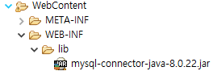

# JDBC

## mysql

- MySQL 드라이버 다운

- lib 경로에 드라이버 파일(.jar)  
  

- driver 클래스명, mysql 서버 url, username, password 문자열 저장

  ```java
  private static final String driver = "com.mysql.cj.jdbc.Driver";
  private static final String url = "jdbc:mysql://127.0.0.1:3306/javaweb?" 
      + "serverTimezone=UTC"
      + "&userUniCode=yes" + "&characterEncoding=UTF-8";
  private static final String user = "root";
  private static final String pwd = "root";
  ```

- 드라이버 로드 후 Connection 객체를 얻음

  ```java
  private Connection con;
  private Statement stmt;
  
  private void connDB() {
      try {
          // 드라이버 클래스 로드
          Class.forName(driver);
          System.out.println("Mysql 드라이버 로딩 성공");
          
          // connection 객체 생성
          con = DriverManager.getConnection(url, user, pwd);
          System.out.println("Connection 생성 성공");
          
          stmt = con.createStatement();
          System.out.println("Statement 생성 성공");
      } catch (Exception e) {
          e.printStackTrace();
      }
  }
  ```

  

## Statement

-  Statement 객체는 DBMS에서 다시 SQL문을 컴파일
- executeQuery & executeUpdate

## PreparedStatement

PreparedStatement는 SQL문을 미리 컴파일해서 재사용

- insert 문

  ```java
  String query = "insert into t_member"
  		+ " (id,pwd,name,email)"
  		+ " values(?,?,?,?)";
  
  pstmt = con.prepareStatement(query);
  
  pstmt.setString(1, id);
  pstmt.setString(2, pwd);
  pstmt.setString(3, name);
  pstmt.setString(4, email);
  
  pstmt.executeUpdate();
  ```

  

- 

## DataSource

- 데이터베이스가 필요할 때 마다 연결을 생성하는 것은 좋지 않은 방법
- DB 연결은 시간이 많이 걸리는 작업이기 때문
- 미리 DB와 연결시킨 상태를 유지하는 기술 **커넥션 풀**이 필요
- 톰캣 컨테이너는 자체적으로 커넥션풀 기능을 제공

### JNDI

- Java Naming and Directory Interface
- 실제 웹 애플리케이션에서 ConnectionPool 객체를 구현할 때는 Java SE에서 제공하는 javax.sql.DataSource 클래스를 이용
- 웹 애플리케이션 실행 시 톰캣의 ConnectionPool 객체에 접근할 때는 JNDI 이용
- 필요한 자원을 키/값 쌍으로 저장한 후 필요할 때 키를 이용해 값을 얻는 방법
- JNDI의 사용 예
  - HttpRequest.getParameter(name)
  - 해시맵과 해시테이블
  - 도메인 네임으로 IP 주소 가져올 때
- 

