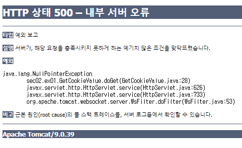

# Servlet

- 일반 자바 프로그램과는 다르게 톰캣 같은 JSP/Servlet 컨테이너에서 싱행된다.

- 스레드 방식으로 실행된다.
  - 컨테이너의 종류에 관계없이 실행된다. (플랫폼 독립적)``

## 서블릿 매핑

- web.xml
- @WebServlet 어노테이션

2.x 버전까지는 web.xml파일이 자동으로 생성되지만 3.1 버전 부터 어노테이션을 지원하기 때문에 web.xml 파일이 자동으로 생성되지 않는다. (생성하려면 프로젝트 생성시 생성하기 체크를 해야한다)

## 요청 받기

- `.getParameter`
- `.getParameterValues`

## 응답 하기

### MIME-TYPE

서버에서 웹 브라우저로 데이터를 전송할 때는 어떤 종류의 데이터를 전송하는지 웹 브라우저에게 알려주어야 한다.(데이터 종류를 미리 알면 더 빠르게 처리가 가능)

이러한 데이터 종류들을 **MIM-TYPE**이라 한다.

- MIME-TYPE의 종류
  - HTML로 전송시 : `text/html`
  - 일반 텍스트 전송 : text/plain
  - XML 데이터로 전송 : `application/xml`
  - JSON 데이터 전송 : `application/json`
- 이러한 데이터의 종류들은 톰캣 컨테이너의 web.xml 파일에 정의되어 있다.

### 응답하기

```java
protected void doGet(HttpServletRequest request, HttpServletResponse) throws ServeltException, IOException
{
	request.setCharacterEncoding("utf-8");
    response.setContentType("text/html;charset=utf-8");
    PrintWriter out = response.getWriter();
    
    out.print("출력")
}
```

## doHandel() 메서드

요청 메소드에 관계 없이 요청을 처리할 수 있는 메서드.  
이를 이용해 GET, POST 요청을 하나의 코드로 처리할 수 있다.

```java
protected void doGet(HttpServletRequest request, HttpServletResponse) throws ServeltException, IOException
{
    doHandel(request, response);
}

protected void doPost(HttpServletRequest request, HttpServletResponse) throws ServeltException, IOException
{
    doHandel(request, response)
}

private void doHandle(HttpServletRequest request, HttpServletResponse response) throws ServletException, IOException
{
    ...
}
```

## 포워드

하나의 서블릿에서 다른 서블릿과 연동하는 방법

- 요청에 대한 추가 작업을 다른 서블릿에게 위임
- 요청에 포함된 정보를 다른 서블릿이나 JSP와 공유
- 요청에 정보를 포함시켜 다른 서블릿에 전달
- 모델2 방식 개발 시 서블릿에서 JSP로 데이터를 전달

### 여러 포워드 방식

- **redirect**

  - `HttpServletResponse` 객체의 `sendRedirect()` 메서드 이용
  - 웹 브라우저에 재요청하는 방식

  ```java
  @WebServlet("/first")
  public class FirstServlet extends HttpServlet{
      protected void doGet(HttpServletRequest request, HttpServletResponse response) 
          throws ServletException, IOException {
          response.setContentType("text/html;charset=utf-8");
          PrintWriter out = response.getWriter();
  		// 매칭 url이 "/second"인 서블릿에 요청
          response.sendRedirect("second");
      }
  }
  ```

- **Refresh**

  - `HttpServletResponse` 객체의 `addHeader()` 메서드 이용
  - 웹 브라우저에 재요청하는 방식

  ```java
  @WebServlet("/first")
  public class FirstServlet extends HttpServlet{
      protected void doGet(HttpServletRequest request, HttpServletResponse response) 
          throws ServletException, IOException {
          response.setContentType("text/html;charset=utf-8");
          PrintWriter out = response.getWriter();
  		// 1초 후 "/second"로 재요청
          response.addHeader("Refresh", "1;url=second");
      }
  }
  ```

- **location**

  - JS의 `location` 객체의 `href` 속성 이용
  - 자바스크립트에서 재요청하는 방식

  ```java
  @WebServlet("/first")
  public class FirstServlet extends HttpServlet{
  	protected void doGet(HttpServletRequest request, HttpServletResponse response) throws  ServletException, IOException {
        response.setContentType("text/html;charset=utf-8");
        PrintWriter out = response.getWriter();
        out.print("<script type='text/javascript'>");
        out.print("location.href='second';");
        out.print("</script>");
     }
  }
  ```

- **dispatch**

  - 서블릿이 직접 요청하는 방법
  - `RequestDispatcher` 클래스의 `forward` 메서드를 이용

  ```java
  @WebServlet("/first")
  public class FirstServlet extends HttpServlet{
      protected void doGet(HttpServletRequest request, HttpServletResponse response)  throws  ServletException, IOException { 
          response.setContentType("text/html;charset=utf-8");
          RequestDispatcher dispatch = request.getRequestDispatcher("second?name=lee");  
          dispatch.forward(request, response);
      }
  }
  
  ```

### 바인딩

포워드 시에 다른 서블릿에 데이터를 전송할려면 요청 url에 `"second?name=lee"`처럼 쿼리스트링을 추가하면된다.

하지만 전달할 데이터가 많다면 이러한 방식은 보기에도 안 좋고 불편하다. 이럴 때 사용하는 것이 **바인딩**

- `setAttribute(String name, Object obj)`

  ```java
  request.setAttribute("address", "서울시 마포구");
  ```

- `getAttribute(String name)`

  ```java
  String address = (String)request.getAttribute("address");
  ```

- `removeAttribute(String name)`

  ```java
  reqeust.removeAttribute("address")
  ```

## ServletContext

ServletContext 객체는 애플리케이션 마다(컨텍스트 마다) 1개만 생성되는 객체로 모든 서블릿이 공유할 수 있다.  
그래서 ServletContext에 데이터를 저장해서 컨텍스트 안의 모든 서블릿이 데이터를 사용할 수 있도록 해준다. (request 객체에 데이터를 넣는 것과 다른 점은 굳이 포워드를 하지 않아도 된다는 것이다.)

### 데이터 바인딩

- 데이터 바인딩하기 (데이터 넣기)

  ```java
  ServletContext context = getServletContext();
  List member = new ArrayList();
  member.add("홍길동");
  member.add(30);
  context.setAttribute("member", member);
  ```

- 데이터 가져오기

  ```java
  ServletContext context = getServletContext();				 
  List member = (ArrayList)context.getAttribute("member");
  ```

### 매개변수 설정

- web.xml에 매개 변수 설정

  ```xml
  <web-app>
      <context-param>
          <param-name>menu_member</param-name>
          <param-value>회원등록  회원조회 회원수정</param-value>
      </context-param>
  </web-app>
  ```

- ServletContext 객체에서 `getInitParameter()`로 가져오기

  ```java
  ServletContext context = getServletContext();
  
  String menu_member = context.getInitParameter("menu_member");
  String menu_order = context.getInitParameter("menu_order");
  String menu_goods = context.getInitParameter("menu_goods");
  ```

### 파일 입출력 기능

`ServletContext` 객체의 `.getResourceAsStream()` 메서드를 이용해 파일 리소스의 `InputStream` 객체를 받아온다.

```java
ServletContext context = getServletContext();
InputStream is = context.getResourceAsStream("/WEB-INF/bin/init.txt");
BufferedReader buffer = new BufferedReader(new InputStreamReader(is));
```

## ServletConfig

- `ServletConfig` 객체는 각 서블릿 객체마다 생성
- `ServletConfig` 인터페이스를 `GenericServlet` 클래스가 구현하고 있음
- ServletContext 객체를 가져오는 기능 `getServletContext` 메서드

### @WebServlet 어노테이션을 이용한 방법

```java
@WebServlet(name="initParamServlet",
        urlPatterns = { "/sInit", "/sInit2" }, initParams = {
		@WebInitParam(name = "email", value = "admin@jweb.com"), 
		@WebInitParam(name = "tel", value = "010-1111-2222") })
public class InitParamServlet extends HttpServlet {
```

- @WebServlet 구성 요소들

  | 요소          | 설명                                                       |
  | ------------- | ---------------------------------------------------------- |
  | urlPatterns   | 서블릿과 매칭되는 url                                      |
  | name          | 서블릿 이름                                                |
  | loadOnStartup | 컨테이너 실행 시 서블릿이 로드되는 순서 지정               |
  | initParam     | @WebInitParam 어노테이션을 이용해 매개변수를 추가하는 기능 |
  | description   | 서블릿에 대한 설명                                         |

- 매개변수 값 가져오기

  ```java
  String email = getInitParameter("email");
  String tel = getInitParameter("tel");
  ```

### xml을 이용한 방법

```xml
<?xml version="1.0" encoding="UTF-8"?>
<web-app xmlns:xsi="http://www.w3.org/2001/XMLSchema-instance"
	xmlns="http://java.sun.com/xml/ns/javaee"
	xsi:schemaLocation="http://java.sun.com/xml/ns/javaee http://java.sun.com/xml/ns/javaee/web-app_3_0.xsd"
	id="WebApp_ID" version="3.0">

	<servlet>
		<servlet-name>서블릿 이름</servlet-name>
		<servlet-class>서블릿 클래스 이름</servlet-class>
		<init-param>
        	<param-name>변수 이름</param-name>
            <param-value>값</param-value>
        </init-param>
        <init-param>
        	<param-name>변수 이름</param-name>
            <param-value>값</param-value>
        </init-param>
	</servlet>
</web-app>
```

## 세션 트래킹

사용자 입자에서 웹 페이지 사이의 상태나 정보를 공유하기 위해 프로그래머가 웹 페이지 사이의 연결 기능을 구현하는 것

- \<hidden\> 태그를 이용하는 방법
- URL Rewriting 방법

위 두가지 방법은 브라우저에 정보가 노출되고, 전송 용량에도 한계가 있기 때문에 좋지 않다.

### 쿠키

웹 페이지들 사이의 공유 정보를 클라이언트에 저장해 놓고 필요할 때 여러 웹 페이지들이 공유해서 사용할 수 있도록 함

- 특징
  - 용량에 제한이 있음 (파일 용량은 4kb)
  - 보안이 취약
  - 브라우저에서 사용 유무 설정 가능
  - 도메인 당 쿠키가 만들어짐

- 종류

  | 속성                   | Persistence 쿠키                                             | Session 쿠키                                 |
  | ---------------------- | ------------------------------------------------------------ | -------------------------------------------- |
  | 생성위치               | 파일로 생성                                                  | 브라우저 메모리에 생성                       |
  | 종료 시기              | 쿠키를 삭제하거나 쿠키 설정 값이 종료된 경우 (만료시간 설정 가능) | 브라우저를 종료한 경우                       |
  | 최초 접속 시 전송 여부 | 최초 접속 시 서버로 전성                                     | 최초 접속 시 서버로 전송되지 않음            |
  | 용도                   | 로그인 유무 또는 팝업창을 제한할 때                          | 사이트 접속 시 Session 인증 정보를 유지할 때 |

- 서블릿에서 쿠키 사용하기

  - 쿠키 만들기

      ```java
      protected void doGet(HttpServletRequest request, HttpServletResponse response) throws ServletException, IOException {
          response.setContentType("text/html;charset=utf-8");
          PrintWriter out = response.getWriter();
          Date d = new Date();
          
          // 쿠키이름과 값(문자열)을 통해 쿠키 생성
          // 값은 인코딩 후 저장
          Cookie c = new Cookie("cookieTest", URLEncoder.encode("설명입니다.", "utf-8"));
      c.setMaxAge(24 * 60 * 60);
          //c.setMaxAge(-1);
          
          // 응답에 쿠키를 추가하여 보냄
          response.addCookie(c);
      }
      ```

  - 쿠키 가져오기

    ```java
    protected void doGet(HttpServletRequest request, HttpServletResponse response) throws ServletException, IOException {
        response.setContentType("text/html;charset=utf-8");
        PrintWriter out=response.getWriter();
        
        // 받은 쿠키는 request 객체에 있음
        Cookie[] allValues=request.getCookies();
        
        for(int i=0; i<allValues.length;i++){
            if(allValues[i].getName().equals("cookieTest")){
                
                // 값은 디코딩을 거침
                out.println("<h2>Cookie 값 가져오기 : "+URLDecoder.decode(allValues[i].getValue(),"utf-8"));
            }
        }
    
    }
    ```

    만일 쿠키가 없어서 `allValues`에 `null`이 들어가면 `NullPointerException`에러가 발생  
    

  - 세션쿠키 만들기

    쿠키는 `setMaxAge(-1)`로 설정하면 세션쿠키가 된다.

  > 자바스크립트에서 쿠키를 볼려면 `document.cookie`로 확인할 수 있다.

### 세션

- 특징
  - 세션은 서버의 메모리에 생성, 저장 (쿠키보다 노출될 가능성이 적음)

  - 세션 쿠키과 연동하여 사용됨

  - 서버에 부하를 줄 수 있음

  - 브라우저(사용자)당 한 개의 세션(세션id)이 생성됨

  - 세션은 유효 시간을 가짐(기본은 30분)

    - 톰캣의 web.xml에 세션 기본 유효 시간이 설정되어 있음

      ```xml
      <session-config>
          <session-timeout>30</session-timeout>
      </session-config>
      ```

- 세션 사용하기

  - 세션 생성

    `HttpServletRequest` 객체의 `getSession` 메서드를 통해 `HttpSession` 객체를 얻는다.

    ```java
    HttpSession session = request.getSession();
    ```

    - `getSession()` 또는 `getSession(true)`: 기존의 세션 객체가 없으면 새로 생성
    - `getSession(false)`: 기존의 세션 객체 없으면 null 반환
  - 세션이 생성되면 클라이언트에 `JSESSIONID` 라는 이름의 쿠키 값이 생성되는데, 이것이 session id이다.
  
  - 세션 API 이용하기

## 서블릿 속성과 스코프

- ServletContext : 애플리케이션 스코프
- HttpSession : 세션 스코프(해당 브라우저에서만 접속)
- HttpServletRequest : 리퀘스트 스코프(해당 요청/응답에 대해서만 접근)

## 필터

모든 또는 많은 서블릿마다 똑같이 수행해야하는 일들 (이를테면 응답에 한글이 있어서 인코딩해야 하는 등의 일)에 관한 코드를 모든 서블릿에 작성하는 것은 불편하다. 서블릿에서 처리하기 전 이러한 공통적인 작업을 하나의 코드로 관리할 수 있게 해주는 것이 **Filter API** 이다.

```java
@WebFilter("/*")
public class EncoderFilter implements Filter {
	ServletContext context;

	public void init(FilterConfig fConfig) throws ServletException {
		context = fConfig.getServletContext();
	}

	public void doFilter(ServletRequest request, ServletResponse response, FilterChain chain)
			throws ServletException, IOException {
		System.out.println("doFilter ȣ��");
		request.setCharacterEncoding("utf-8");

		long begin = System.currentTimeMillis();
		chain.doFilter(request, response);
		long end = System.currentTimeMillis();
		System.out.println("작업시간:" + (end - begin) + "ms");
	}

	public void destroy() {
		System.out.println("destroy 호출");
	}

}
```

## 리스너

### HttpSessionBindingListener

세션에 객체를 바인딩(추가)/언바인딩(제거) 할 때마다 실행될 메서드를 설정

`HttpSessionBindingListener` 인터페이스를 구현하고 있는 객체가 세션 객체에 바인딩되면 `valueBound` 메서드가 호출되고, 언바인딩 되면 `valueUnbound` 메서드가 호출 된다.

```java
import javax.servlet.http.HttpSessionBindingEvent;
import javax.servlet.http.HttpSessionBindingListener;

public class LoginImpl implements HttpSessionBindingListener {
	String user_id;
	String user_pw;
	static int total_user = 0;

	public LoginImpl() {
	}

	public LoginImpl(String user_id, String user_pw) {
		this.user_id = user_id;
		this.user_pw = user_pw;
	}

	@Override
	public void valueBound(HttpSessionBindingEvent arg0) {
		System.out.println("사용자 접속");
		++total_user;
	}

	@Override
	public void valueUnbound(HttpSessionBindingEvent arg0) {
		System.out.println("사용자 접속 해제");
		total_user--;
	}
}

```

### HttpSessionListener

`HttpSession`객체가 생성/소멸 시 실행될 메서드 설정

`HttpSession` 객체가 생성되면 `sessionCreated` 메서드가 호출되고, 삭제되면 `sessionDestroyed` 메서드가 호출된다.

`@WebListener` 어노테이션을 붙여주어야 한다.

```java
import javax.servlet.annotation.WebListener;
import javax.servlet.http.HttpSessionEvent;
import javax.servlet.http.HttpSessionListener;

@WebListener
public class LoginImpl implements HttpSessionListener {
	String user_id;
	String user_pw;
	static int total_user = 0;

	public LoginImpl() {
	}

	public LoginImpl(String user_id, String user_pw) {
		this.user_id = user_id;
		this.user_pw = user_pw;
	}

	@Override
	public void sessionCreated(HttpSessionEvent arg0) {
		System.out.println("사용자 접속");
		++total_user;
	}

	@Override
	public void sessionDestroyed(HttpSessionEvent arg0) {
		System.out.println("사용자 접속 해제");
		--total_user;
	}

}

```

