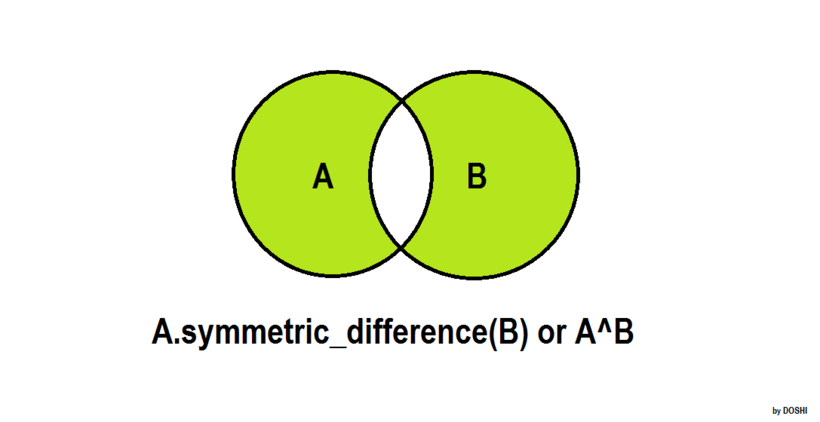

# set (집합)

요소들 간에 중복이 없는 것을 보장하는 데이터 구조.

중복이 없어야 하므로 집어 넣은 요소가 변경되는 것을 막아야 하므로 set에는 immutable한 요소만 넣을 수 있다.

## set의 성질

### mutable

### iterable

### unordered

## set 생성

`{*args}`로 생성한다

```python
s = {1, 2, 3} # set {1, 2, 3} 생성

s = set({1, 2, 3})
# 이렇게도 생성이 가능하나 추천하지 않는다
# 더 타이핑 해야할 뿐더러 {1, 2, 3}을 생성하고 set함수를 또 호출하므로 낭비다.
```

비어있는 집합은 **`set()`** 으로 생성

```python
s = set()
```

### *주의할 점

#### (1) 비어있는 딕셔너리와 혼동하지 말자

```python
d = {} # 빈 딕셔너리 생성
s = set() # 빈 집합 생성

# 둘을 구분하기 위해 빈 집합은 출력도 'set()'으로 나온다
print(d) # {}
print(s) # set()
# 문자열로 바꾸면 더 명확하다
str(d) # '{}'
str(s) # 'set()'
```

#### (2) set은 요소들의 중복을 자동으로 제거해 준다

```python
s = {1, 2, 2, 3, '대구', '서울', '대구'}
print(s) # {1, 2, '서울', 3, '대구'}
```

#### (3) set은 요소들의 순서를 고려하지 않는다

```python
s1 = {3, 2, 1, 0, -1}
print(s1) # {0, 1, 2, 3, -1}
s2 = {1, 2, 3, 0, -1}
print(s2) # {0, 1, 2, 3, -1}
print(s1 == s2) # True
```

## 요소 추가하기

### 요소 1개 추가하기

`add()`를 이용하기

```python
s = {1, 2}

s.add(4)
print(s) # {1, 2, 4}
```

중복된 값을 추가할 때도 역시 알아서 중복을 제거해준다

```python
s = {1, 2}
s.add(1)
print(s) # {1, 2}
```

### 요소 여러 개 추가하기

`update()`를 이용

```python
s = {1, 2, 3}
s.update({4, 5 ,6})

print(s) # {1, 2, 3, 4, 5, 6}
```

## 요소 삭제하기

### .remove()

`.remove(item)` item과 값이 같은 요소를 지운다.

없다면 **KeyError** 발생

### .discard()

없어도 **Error 발생하지 않음**

## 집합 연산

- symmetric_difference (대칭차집합)

  

  - `.symmetric_difference` or `^`

      ```python
      >>> A = {1, 2 3, 4, 5}
      >>> B = {3, 4, 5, 6, 7}
      >>> A.symmetric_difference(B)
      {1, 2, 6, 7}
      >>> A ^ B
      {1, 2, 6, 7}
      ```

  - `.symmetric_difference_update`

    해당 set이 대칭차집합의 결과로 `update` 된다.

    

